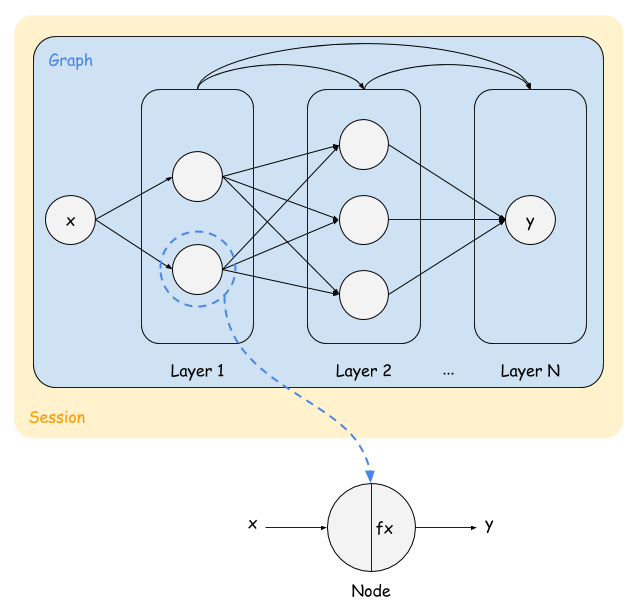

whale.js
===

## Introduction

whale.js is a data process framework designed for simplicifing code writing. Especially, when we write data-oriented process logics, different data sources correspond to different logics. Now whale.js is the choice.

### Architecture



### Template

whale.js provides template mechanism. Every data process logic is written as whale.js template file in `template/` folder. The core elements of whale.js template are:

- graph (`template/graph`)
- node (`template/node`)
- fx (`template/fx`)

Graph describes how the data process flows work, which is composed by nodes. In consideration of node reuse, we can define common functions called fx.

### Instance

Whale instance is created by loading template folder and simply calling `use` api.

```javascript
const Whale = require('whale.js');
var whale = (new Whale('./template')).use('calculator');
```

### Session

Then call run api to run the whale. All intermediate variables store in whale `whale.session`.

```javascript
whale.run(input_object, function(err) {
  console.log('input_object:', whale.session.x);
  console.log('output_object:', whale.session.y);
  console.log('dump all:', whale.session);
});
```

### Data sharing

There are global predefined functions for cross-node accessing.

- Current node session setter/getter: `node.$setLocals` or `$`
- Cross node session getter: `node.$getGlobals` or `$$`

## Example 1: calculator

```javascript
// template/fx/calculator.js
module.exports = function(node, callback) {
  var js = 'var v = ' + node.x.v1 + node.x.op + node.x.v2;
  eval(js);
  callback(null, v);
};
```

```javascript
// template/graph/test.js
module.exports = [
  [
    {
      fx: 'calculator',
      x: `{
        v1: $$('x.value'),
        v2: 3,
        op: '*',
      }`,
    },
  ],
];
```

## Example 2: parallel

```javascript
// template/graph/test.js
module.exports = [
  [
    {
      id: 'a',
      fx: 'request',
      x: `{
        url: $$('x.urls')[0],
      }`,
      y: `JSON.parse($('fx')).args.test`,
    },
    {
      id: 'b',
      fx: 'request',
      x: `{
        url: $$('x.urls')[1],
      }`,
      y: `JSON.parse($('fx')).args.test`,
    },
  ],
  [
    {
      id: 'c',
      y: `$$('a.y') + $$('b.y')`,
    },
  ],
];
```

## More examples

Step 1: git clone https://github.com/zhangxiaoyang/whale.js

Step 2: cd whale.js/ && npm install

Step 3: npm run test
